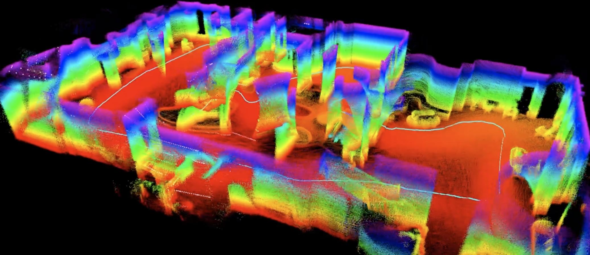

# PALLAS

[](https://github.com/RobotFlow-Labs/project_pallas_ros2/actions/workflows/ci.yml)



`PALLAS` is an ANIMA ROS2 module for LiDAR-inertial odometry and local mapping.
It is optimized for teams who want a practical bring-up path before they invest
in deeper SLAM tuning.

Current launch imagery uses real screenshots captured from Unitree LiDAR output
rather than placeholder artwork.

Recommended expansion:

`PALLAS` = `Probabilistic Alignment for LiDAR Localization And State-fusion`

## Why PALLAS

PALLAS focuses on the surfaces that make a ROS2 LiDAR stack easy to evaluate:

- shipped vendor presets for common LiDAR + IMU topic conventions
- `demo-fetch` and `demo-replay` so new users can see the stack run without live hardware
- `doctor --markdown` for reproducible GitHub bug reports and support requests
- first-party Docker smoke coverage for Humble and Jazzy
- portable C++/Eigen core with a clear Core vs CT runtime split

## 3-Command Quickstart

This is the fastest no-hardware path from clone to visible demo output:

```bash
uv sync --group dev
uv run pallas-dev build
uv run pallas-dev demo-fetch ouster-core-demo && uv run pallas-dev demo-replay ouster-core-demo
```

That flow downloads the canonical Ouster/Core demo package, starts the shipped
runtime against the bag replay, and prints the exact RViz command:

```bash
rviz2 -d artifacts/demos/pallas-demo-ouster-core/rviz/pallas_demo.rviz
```

If you are evaluating from a laptop or Apple Silicon machine, use the Docker
path first:

```bash
./scripts/docker_smoke.sh
```

More operator guidance:

- no-hardware walkthrough: [`docs/demo_quickstart.md`](docs/demo_quickstart.md)
- first live LiDAR bring-up: [`docs/first_lidar_test.md`](docs/first_lidar_test.md)
- preset details and topic conventions: [`docs/sensor_presets.md`](docs/sensor_presets.md)
- launch asset checklist: [`docs/launch_assets.md`](docs/launch_assets.md)

## Supported Sensors

Generated from preset metadata via `uv run pallas-dev preset-matrix --format markdown`.

| Vendor | Core | CT | Cloud Topic | IMU Topic | Base Frame |
| --- | --- | --- | --- | --- | --- |
| Generic | yes | yes | /points_raw | /imu/data | imu |
| Hesai | yes | yes | /lidar_points | /lidar_imu | hesai_lidar |
| Livox | yes | yes | /livox/lidar | /livox/imu | livox_frame |
| Ouster | yes | yes | /ouster/points | /ouster/imu | os_imu |
| RoboSense | yes | yes | /rslidar_points | /rslidar_imu_data | rslidar |
| RoboSense/rslidar | yes | yes | /rslidar_points | /rslidar_imu_data | rslidar |
| Unitree | yes | yes | /unilidar/cloud | /unilidar/imu | unilidar_imu |
| Velodyne | yes | yes | /velodyne_points | /imu/data | imu |

Explore the shipped support matrix from the CLI:

```bash
uv run pallas-dev preset-list
uv run pallas-dev preset-matrix --format markdown
uv run pallas-dev preset-show pallas_core_unitree.yaml
uv run pallas-dev launch-hint pallas_ct_ouster.yaml
uv run pallas-dev ros-check pallas_core_ouster.yaml
```

These presets are integration starting points, not a substitute for calibration.
For any sensor that publishes LiDAR and IMU in different frames, you still need
to set `sensor_to_body_translation` and `sensor_to_body_rpy` to your measured
LiDAR-to-IMU extrinsics.

## Proof Surface

The canonical demo asset is intentionally small and repeatable so it can drive
screenshots, release notes, and smoke checks from one source.

| Demo | Preset | Output topics | Benchmark summary | Launch assets |
| --- | --- | --- | --- | --- |
| `ouster-core-demo` | `pallas_core_ouster.yaml` | `/pallas/core/pose`, `/pallas/core/odom`, `/pallas/core/aligned_scan`, `/pallas/core/local_map` | `uv run python scripts/demo_benchmark.py ouster-core-demo --run-replay` | [`docs/launch_assets.md`](docs/launch_assets.md) |

## Overview

PALLAS provides a modular estimation stack for robots that need:

- LiDAR and IMU ingestion in ROS2
- realtime odometry from high-rate inertial propagation
- scan alignment into a locally consistent frame
- rolling local map maintenance
- a research path toward continuous-time trajectory modeling

The package is built around a portable C++/Eigen core, with ROS2 used as the integration layer for topics, TF, launch, and deployment.

## Functional Scope

PALLAS currently implements these runtime capabilities:

- `PointCloud2` ingestion with flexible field-name handling for `x`, `y`, `z`, `intensity`, `ring` or `line`, and per-point time
- range clipping and relative-time normalization during scan ingest
- stationary IMU bootstrap to estimate initial attitude and sensor biases
- bias-aware strapdown propagation for pose and velocity tracking
- voxelized scan sampling
- local normal estimation from neighborhood covariance
- rolling surfel-map integration for local mapping
- ROS2 pose, odometry, aligned scan, and map publication
- TF publication from odometry frame to base frame

## Runtime Profiles

PALLAS exposes two explicit runtime profiles.

### PALLAS Core

Realtime runtime for deployment-oriented robotics workloads.

- portable C++/Eigen implementation
- lower complexity and smaller dependency surface
- scan ingest, IMU bootstrap, strapdown tracking, scan sampling, and local surfel-map maintenance
- intended for live robot execution and benchmarking

Default launch:

```bash
ros2 launch anima_pallas_ros2 pallas_core.launch.py
```

Primary config:

`ros2_ws/src/anima_pallas_ros2/config/pallas_core.yaml`

### PALLAS CT

Research runtime for continuous-time trajectory experimentation.

- includes the Core runtime path
- adds spline-backed output smoothing through the continuous-time layer
- intended for research iteration, evaluation, and model refinement

Launch:

```bash
ros2 launch anima_pallas_ros2 pallas_ct.launch.py
```

Primary config:

`ros2_ws/src/anima_pallas_ros2/config/pallas_ct.yaml`

## ROS2 Interfaces

Both runtime profiles expose the same functional interface pattern with profile-specific topic prefixes.

Inputs:

- `pointcloud_topic`
- `imu_topic`

Outputs:

- `pose_topic`
- `odom_topic`
- `aligned_scan_topic`
- `map_topic`

Frames:

- `odom_frame`
- `base_frame`

The node also publishes the odometry-to-base transform through TF.

## Configuration Surface

The runtime is parameterized through ROS2 parameters.

Core estimation parameters:

- `lidar_type`
- `stationary_init_sec`
- `gravity_mps2`
- `min_range_m`
- `max_range_m`

Scan processing parameters:

- `scan_voxel_size_m`
- `scan_normal_radius_m`
- `scan_min_points_for_normal`

Map parameters:

- `map_voxel_size_m`
- `map_max_surfels`
- `map_max_age_sec`
- `map_publish_period_scans`

Continuous-time parameters:

- `ct_min_control_points`
- `ct_max_control_points`

Extrinsics:

- `sensor_to_body_translation`
- `sensor_to_body_rpy`

## Platform Support

The core runtime is intentionally portable.

- primary implementation: C++17 + Eigen + ROS2
- suitable target classes: Jetson, Apple Silicon environments with ROS2, and standard x86 Linux systems
- MLX is not required for the current odometry stack
- MLX remains a valid future path for optional learned or perception-heavy accelerators on Apple Silicon

## Repository Layout

```text
project_pallas_ros2/
  pyproject.toml
  uv.lock
  config/
    colcon.defaults.yaml
  docs/
    apple_silicon.md
    architecture.md
    clean_room.md
    demo_quickstart.md
    launch_assets.md
    runtime_profiles.md
    media/
  python/
    pallas_dev/
  ros2_ws/
    src/
      anima_pallas_ros2/
  scripts/
  tests/
```

## Developer Workflow

`uv` manages the Python developer environment and helper tooling. `colcon` builds the ROS2 workspace.

Bootstrap the environment:

```bash
cd /Users/ilessio/Development/AIFLOWLABS/projects/ROS2/project_pallas_ros2
uv sync --group dev
uv run pallas-dev doctor
uv run pallas-dev preset-list
uv run pallas-dev demo-fetch ouster-core-demo
```

Laptop and Apple-first smoke test:

```bash
./scripts/docker_smoke.sh
```

That path builds a ROS2 container, runs the preset checks, Python checks, and a
full `colcon build/test` smoke pass without requiring a native ROS install on
your machine.

Live sensor bring-up path:

```bash
uv run pallas-dev ros-check pallas_core_ouster.yaml
uv run pallas-dev build
uv run pallas-dev launch-live pallas_core_ouster.yaml
```

Or use the helper that builds on first use, verifies the ROS graph, and starts
the runtime:

```bash
./scripts/live_lidar_test.sh pallas_core_ouster.yaml
```

Use Docker for fast evaluation and CI-style validation. Use the live path above
when the LiDAR driver is actually publishing on your ROS2 graph.

Support-thread snapshot:

```bash
uv run pallas-dev doctor --markdown --preset pallas_core_ouster.yaml
```

Build the ROS2 package:

```bash
source /opt/ros/$ROS_DISTRO/setup.bash
export COLCON_DEFAULTS_FILE=$PWD/config/colcon.defaults.yaml
colcon build --base-paths ros2_ws/src
source ros2_ws/install/setup.bash
```

Run the Core profile:

```bash
ros2 launch anima_pallas_ros2 pallas_core.launch.py
```

Run the CT profile:

```bash
ros2 launch anima_pallas_ros2 pallas_ct.launch.py
```

Run a vendor preset:

```bash
ros2 launch anima_pallas_ros2 pallas_core.launch.py config_name:=pallas_core_unitree.yaml
ros2 launch anima_pallas_ros2 pallas_core.launch.py config_name:=pallas_core_velodyne.yaml
```

Inspect or validate the shipped preset pack:

```bash
uv run pallas-dev preset-show pallas_core_velodyne.yaml
uv run pallas-dev preset-check
uv run pallas-dev preset-matrix --format markdown
```

## Docker Evaluation Path

The repository includes a first-party Docker smoke-test image so non-Jetson
evaluators can validate PALLAS quickly on standard Linux laptops and Apple
Silicon machines running Docker Desktop.

Build the image:

```bash
docker build --build-arg ROS_DISTRO=humble -t pallas-smoke:humble .
```

Run the full smoke test:

```bash
./scripts/docker_smoke.sh
```

That smoke path now:

- synthesizes the canonical demo bag
- validates `demo-fetch`
- dry-runs `demo-replay`
- runs `scripts/demo_benchmark.py` against the canonical replay

Try a newer ROS2 distro:

```bash
ROS_DISTRO=jazzy ./scripts/docker_smoke.sh
```

## Validation

Repository-level validation available through the current tooling includes:

- `uv run pytest`
- `uv run ruff check python tests`
- `uv run pallas-dev preset-check`
- `uv run pallas-dev demo-replay ouster-core-demo --dry-run`
- `uv run python scripts/demo_benchmark.py ouster-core-demo --run-replay`
- launch-file syntax checks through Python compilation
- GitHub Actions automation in `.github/workflows/ci.yml`
- Docker smoke test through `./scripts/docker_smoke.sh`

Full ROS2 validation should additionally include:

- `colcon build`
- node startup checks
- bag replay on representative LiDAR/IMU data
- topic, TF, and map-output verification

## Near-Term Engineering Priorities

The current stack is a strong baseline, but the next implementation passes should focus on:

1. replacing CT output smoothing with full continuous-time residual optimization
2. adding scan-to-surface residuals over the surfel map
3. introducing IMU residual linearization and solver loops
4. adding repeatable benchmarking and bag-replay metrics
