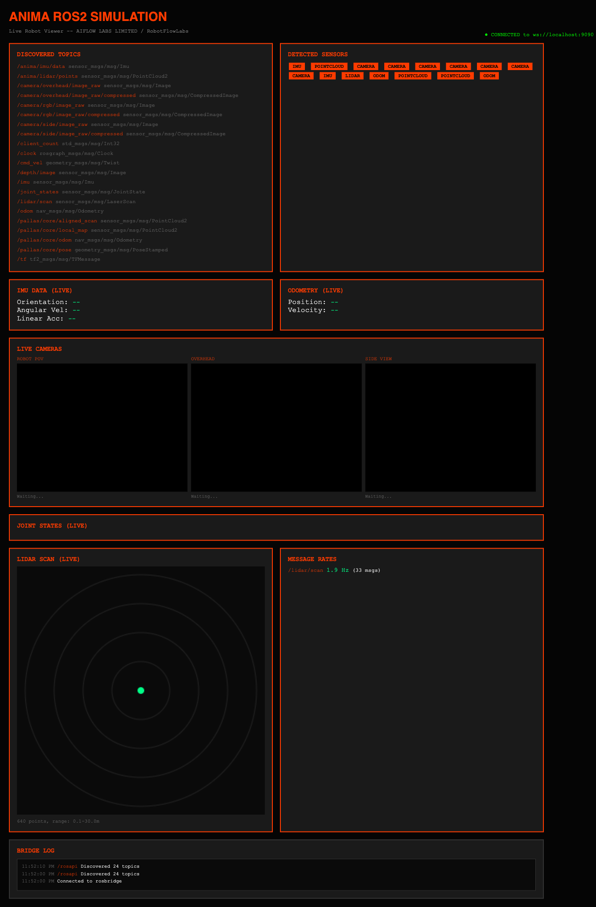
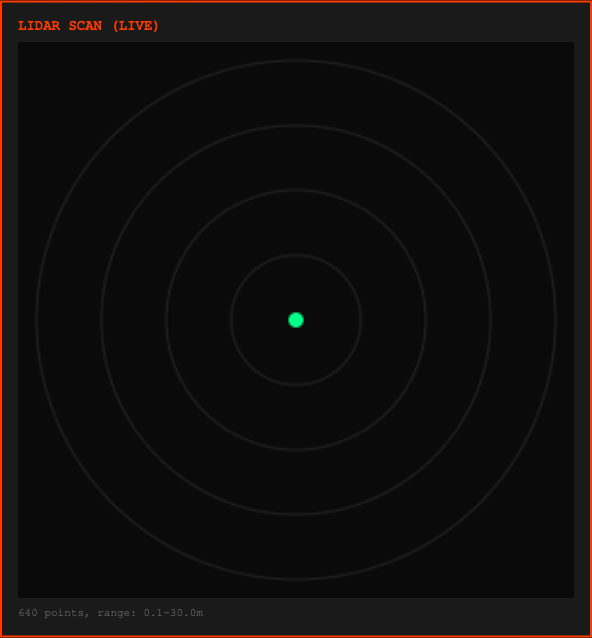

# Gazebo Simulation

PALLAS can run against the shared ANIMA Gazebo stack in
`/Users/ilessio/Development/AIFLOWLABS/projects/anima-Ros2-Gazebo`.

This path is intended for "no hardware, real ROS graph" smoke testing:

- Gazebo publishes simulated sensors
- the bridge exposes the ANIMA module contract on `/anima/...`
- PALLAS runs in its own Jazzy container on the same DDS network

## Presets

PALLAS ships a dedicated Gazebo preset pair:

- `pallas_core_gazebo.yaml`
- `pallas_ct_gazebo.yaml`

Both consume:

- `/anima/lidar/points`
- `/anima/imu/data`

## Recommended World

Use `terrain.sdf` for PALLAS. The current top-level Gazebo repo defaults to
`warehouse.sdf`, but that world is wired for a mobile base with 2D scan topics
and is not the right smoke path for `PointCloud2` odometry.

`terrain.sdf` is the current default in `scripts/gazebo_lidar_test.sh` because
it exposes a 3D LiDAR point cloud plus IMU.

## CPU Smoke Path

```bash
./scripts/gazebo_lidar_test.sh
```

That flow:

1. starts the external Gazebo repo
2. detects the live Gazebo point-cloud and IMU topics
3. bridges them into `/anima/lidar/points` and `/anima/imu/data`
4. builds a Jazzy PALLAS image
5. launches PALLAS against `pallas_core_gazebo.yaml`

The launcher defaults to `rmw_fastrtps_cpp`, which matches the current Jazzy
image contents. Override `RMW_IMPLEMENTATION` explicitly if you want a
different DDS backend.

To run the CT profile instead:

```bash
./scripts/gazebo_lidar_test.sh --profile ct
```

## Live Viewer Snapshots

Full browser view with discovered PALLAS topics and the bridged ROS graph:



Focused LiDAR panel from the same live run:



## CUDA-Only Path

```bash
./scripts/gazebo_cuda_test.sh
```

That wrapper is the dedicated NVIDIA path and resolves to:

```bash
./scripts/gazebo_lidar_test.sh --gpu
```

Use it on hosts with a working NVIDIA Docker runtime and the simulator repo's
CUDA image build path.

## Useful Variants

Choose an explicit preset:

```bash
./scripts/gazebo_lidar_test.sh pallas_ct_gazebo.yaml
```

Choose a different world:

```bash
./scripts/gazebo_lidar_test.sh --world terrain.sdf
```

Reuse existing images:

```bash
./scripts/gazebo_lidar_test.sh --skip-sim-build --skip-image-build
```

## Stop the Simulator

The PALLAS container exits cleanly with `Ctrl-C`, but the external Gazebo stack
is left running so you can inspect the viewer or reuse it.

Stop it from the simulator repo:

```bash
cd /Users/ilessio/Development/AIFLOWLABS/projects/anima-Ros2-Gazebo
docker compose down
```

## Current Caveats

- The CUDA path depends on a real NVIDIA host. It is not meaningfully testable
  on Apple Silicon or CPU-only machines.
- The simulator repo still has mixed historical bridge definitions. The PALLAS
  launcher detects the live Gazebo topics at runtime instead of trusting stale
  static paths.
- This path is for integration smoke testing. It is not a substitute for
  measured LiDAR-to-IMU extrinsics on real hardware.
